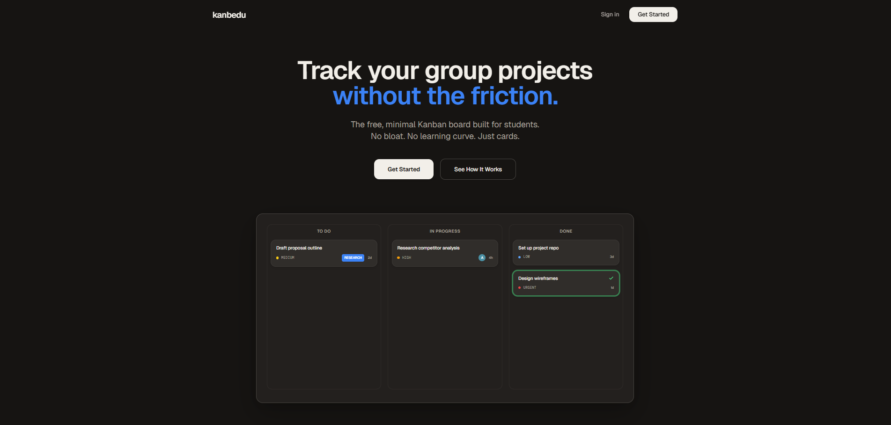
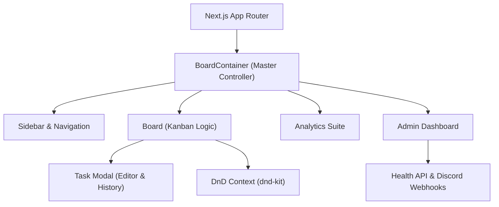

<h1 align="center">Kanbedu</h1>

<p align="center">
  <strong>A premium, minimal Kanban board system built for high-efficiency project management with a paper-and-ink aesthetic.</strong>
</p>

<p align="center">
  
  
  
  
  
</p>

---

## Overview

Kanbedu is a high-performance project tracking application inspired by the minimalism of physical Kanban boards and the power of modern productivity tools like ClickUp. Built with Next.js 14 and a "Paper & Ink" design system, it provides a distraction-free environment for teams to organize, track, and analyze their workflows in real-time.

Originally designed for student group projects, it features robust authentication, deep analytical insights, and an administrative layer for system-wide health monitoring and support.

---

<p align="center">
  
</p>

---

## Features

### 📋 Core Kanban Experience

- **Multi-Board Management**: Organize multiple projects simultaneously with a dedicated board for each.
- **Dynamic Columns**: Add, rename, and reorder columns with a single click. Mark columns as "Done" to trigger automated completion logic.
- **Advanced Task Cards**: Rich cards displaying priority badges, assignee avatars, deadline countdowns, and real-time comment counts.
- **Fluid Drag & Drop**: Seamlessly move tasks across columns or reorder them within a phase using `@dnd-kit`.

### 🤝 Collaboration & Security

- **JWT Authentication**: Secure user accounts with session persistence and protected API routes.
- **Relational Invite System**: Generate unique, shareable invite tokens to bring team members into specific boards securely.
- **Smart Assignees**: Relational user attribution ensuring every task has a clear owner.
- **Real-Time Sync**: Powered by Supabase Realtime—changes made by one user are instantly reflected across all connected clients without page refreshes.

### 📝 Content & Integrity

- **Markdown Description Engine**: A powerful TipTap-based editor supporting bold, italics, headers, lists, links, and code blocks.
- **Version History & Diffs**: Every major change to a task description is snapshotted. Compare versions visually using the built-in Diff Viewer.
- **Activity Auditing**: A detailed timeline of every mutation (status changes, renames, assignment updates) with user attribution.
- **Card Tagging**: Organize tasks with a flexible many-to-many tagging system. Color-coded chips for instant visual categorization.

### 📊 Professional Analytics

- **Internal Activity Heatmap**: A 52-week "GitHub-style" contribution graph showing the pulse of your project.
- **Engagement Charts**: Weekly area charts and completion metrics to track team velocity.
- **Integrity Monitor**: Automated flags for "Speed-runs" (tasks finished too fast) or "Column Skips" (tasks moved straight to Done) to ensure process adherence.
- **Phase Health**: Visual indicators of stagnant tasks and average cycle time per column.

### 🛠️ Administrative Governance

- **Admin Dashboard**: Secure panel for managing bug reports and user feedback.
- **Support System**: Direct line for users to report issues, featuring Discord Webhook notifications for instant admin alerts.
- **System Health Monitor**: Real-time infrastructure tracking, including database latency and connection status with a pulsing heartbeat indicator.

---

## Tech Stack

| Component | Technology | Purpose |
| :--- | :--- | :--- |
| **Framework** | Next.js 14 (App Router) | Server-side rendering, API routes, and optimized client interactivity. |
| **Language** | TypeScript | End-to-end type safety for a robust, maintainable codebase. |
| **Database** | Supabase (PostgreSQL) | Scalable, high-performance relational storage with built-in backups. |
| **ORM** | Prisma | Type-safe database access layer and simplified migrations. |
| **Realtime** | Supabase Realtime | WebSocket-based instant state synchronization across clients. |
| **Styling** | Tailwind CSS | Custom design system using the "Paper & Ink" aesthetic. |
| **Analytics** | Recharts | Dynamic, responsive charting and data visualization. |
| **Editor** | TipTap + react-markdown | Professional rich-text editing and markdown rendering. |

---

## Architecture



---

## Installation

### Prerequisites

- Node.js 18.x or higher
- A Supabase project (for Postgres and Realtime)
- A Discord Webhook (optional, for admin alerts)

### Steps

1. **Clone the repository:**
   ```bash
   git clone https://github.com/softcycled/Kanbedu.git
   cd Kanbedu
   ```

2. **Install dependencies:**
   ```bash
   npm install
   ```

3. **Configure Environment Variables:**
   Create a `.env` file in the root:
   ```env
   DATABASE_URL="your-supabase-connection-string"
   DIRECT_URL="your-supabase-direct-url"
   NEXTAUTH_SECRET="your-secret-key"
   DISCORD_WEBHOOK_URL="your-webhook-url"
   ```

4. **Initialize the Database:**
   ```bash
   npx prisma db push
   npx prisma generate
   ```

5. **Start Development Server:**
   ```bash
   npm run dev
   ```

6. **Seed Admin User (Optional):**
   Run the administrative seed script to grant admin privileges to your primary account:
   ```bash
   node src/lib/seed-admin.js
   ```

---

## Anti-Spam & Performance Design

- **Anti-Farming Deduplication**: The system detects and ignores rapid completion-spamming to keep analytics data pure.
- **Optimized N+1 Queries**: All board and activity fetches are flattened and optimized to ensure sub-100ms response times even with large datasets.
- **Debounced Persistence**: Task descriptions and fields are debounced to minimize database I/O while ensuring zero data loss.

---

*Built with passion by the Kanbedu Team. Aesthetic inspired by minimalist stationary and high-end productivity workflows.*
